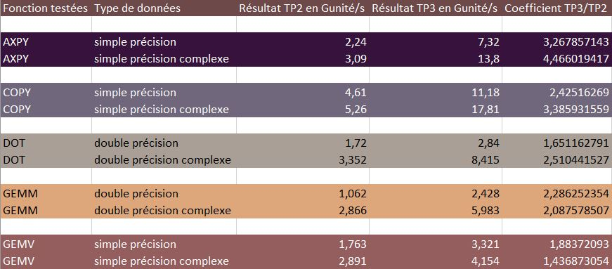

# MN_TP3
### FODOR Gergely, PELISSE VERDOUX Cyprien , VIALLET Camille

## Parallélisation

Les fonctions BLAS sont souvent utilisées par de divers programmes et avec des jeux de donnés très grands. Il est important 
de réduire un maximum le coup de ces fonctions. Dans le TP2, nous faisons attention à cela en réduisant la complexité 
des algorithmes implémentés ou encore en utilisant des variables de type `register` afin de minimiser les lectures en mémoire.

Dans ce TP, nous continuerons à augmenter les performances des fonctions BLAS mais cette fois en utilisant les fonctionnalités
offertes par le matériel. Nous allons tout d'abord répartir les calculs sur plusieurs threads, utilisant ainsi le plein
potentiel du processeur. Nous allons ensuite vectoriser nos donnés, nous permettant ainsi de traiter plusieurs variables
à la fois. *Cette dernière partie étant optionnelle, seul une fonction a été vectorisé afin de voir les différences de 
performance.*

## OpenMP

La librairie OpenMP nous permet de faire du multi-threading sans avoir à utiliser les mutex et autres appels systèmes.
Grâce à des primitives de type `#pragma omp [OPTION]`, nous pouvons facilement répartir certaine partie de l'exécution 
sur plusieurs threads. Dans notre cas, ce sont les boucles sur des vecteurs et matrices de grande taille que nous allons 
paralléliser.
Dans notre cas, nous avons utiliser en majorité la primitive: `#pragma omp parallel for` qui permet de distribuer une boucle for sur plusieurs coeurs.
Prenons l'exemple de dot.c, dans ce fichier il est question de mutliplier deux vecteurs. Pour améliorer les performances, nous avons donc utiliser une primitive de la forme:

`  #pragma omp parallel for firstprivate(incX) reduction(+:dot)`

Décorticons ce que cela signifie:
* Déjà nous déclarons une primitive qui indique que l'on va utiliser plusieurs coeurs et que l'on va le faire sur une boucle for.
* `firstprivate(variable)` est là pour indiquer que chaque thread aura sa variable *incX* et que cette dernière est initialisé au début. Dans notre cas, il est à noté que *incX* et *incY* sont identiques, nous avons donc remplacé *incY* par *incX*.
* `reduction(op:X)` permet de dire que chaque thread aura sa propre variable *X* et qu'a la fin de l'execution, toutes les variables *X* seront réunis en une seul grâce à l'opérateur op. Dans notre cas, nous signifions donc que toutes les valeurs de dot seront additionés.

il est à noté que au départ nous n'avions pas forcément des résultats probant, les performances étaient basse, après recherche de la cause, nous avons trouvés que que cela était dû à nos données qui étaient trop petites. En effet, il faut creer les threads donc si il y a peu de données à traiter, alors les performances ne seront pas au rendez-vous. De même, si les données sont trop grosses et qu'elles dépassent du cache, les performances s'en retrouverons également affectés. Normalement, dans notre cas, nous sommes arrivés au juste milieu, les données ne sont ni trop grandes, ni trop petites, et nous obtenons un gain de performances.
Le tableau ci-dessous, nous donnes d'ailleurs les chiffres relevés. Pour obtenir sex chiffres, nous avons fait une moyenne des differentes performances obtenus avec un jeu de donnée suffisament grand. Tous les test ont ét effectués sur le même ordinateur pour garantir la fiabilité des données.


Nous pouvons observer des gains de performance en général plus ou moins marqués en fonction des fonctions. Pour BLAS1, on voit que les meilleur performances sont atteintes avec des nombres complexes, et c'est AXPY qui à la meilleur amélioration de performances avec **4.46**. Les fonctions de BLAS2 et BLAS3 ont des amélioration plus nuancés mais néamoins notable alors que ces deux fonctions travaillent avec des jeux de données très conséquent, la moindre amélioration est donc à prendre. La fonction qui semble avoir le moins profité de la mise en place d'openMP semble être *gemv* avec une augmentation de 1.88 pour les type *simple précision* et de 1.43 pour les types *simple précision complexe*.

## Vectorisation

Comme spécifié dans l'introduction, cette partie du TP est optionnel. Néanmoins, nous avons voulu voir le potentiel
de la vectorisation et nous l'avons implémenté sur la fonction `scopy()`. Cette implémentation étant en conflit avec le 
reste du TP, je vous invite à regarder le code dans **test_copy_vect.c**.

La fonction `scopy()` copie un vecteur de float dans un autre vecteurs de float. Ici, notre but est de modifier le format
de donné afin que chaque case du tableau contiennent 4 float. On utilise le type `__m128`. L'initialisation du vecteur 
devient :

```c
#define VECSIZE 65536

typedef __m128 vfloat[VECSIZE];

void vector_init(vfloat V, float x) {
    unsigned int i;

    float tab[4] __attribute__ ((aligned(16))) = {x, x, x, x};

    for (i = 0; i < VECSIZE; i++)
        V[i] = _mm_load_ps(tab);

    return;
}
```

La fonction `scopy()` change à peine car la copie reste la même. Seul le prototype de la fonction devient :

```c
void mncblas_scopy(const int N, const __m128 *X, const int incX, __m128 *Y, const int incY);
```

Cette simple modification permet d'avoir une copie à **30 GB/s**, contre le **11 GB/s** avec seulement la parallélisation 
OpenMP. 

## Conclusion

Lors du semestre 5, nous avons vu comment rendre un algorithme plus performant en en réduisant la complexité. Nous avons 
notamment vu avec les tries la différence entre du O(n²) et du O(log n). L'algo avancé de ce semestre nous a montré qu'il 
est possible d'obtenir des gains de performances considérables lors de l'implementation de ces algorithmes. Le multi-threading 
et la vectorisation prennent avantage du matériel afin d'obtenir des programmes toujours plus rapides. D'autant plus qu'au niveau matériel, il est plus économique de rajouter des coeurs que de rajouter de la fréquence d'horloge. Lors de l'écriture d'algorithme, nous devrons donc dorénavant faire attention à rendre l'algorithme le moins complexe possible, ou à défaut gagner le plus possible en performance au niveau matériel.
