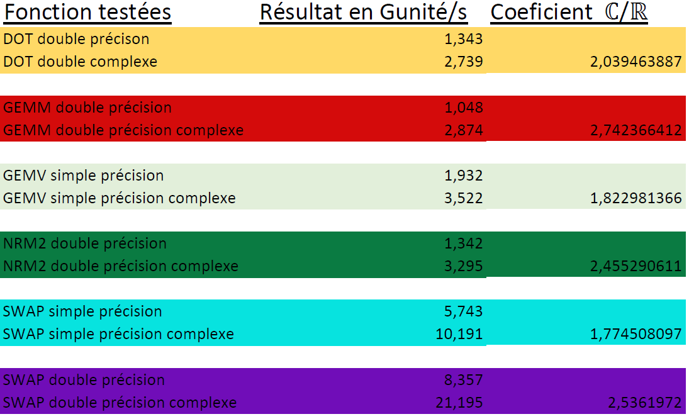

# MN_TP3
### FODOR Gergely, PELISSE VERDOUX Cyprien , VIALLET Camille

## Résultats de performance du TP2

Le tableau ci-dessus montre nos résultats de performance du TP précédent. Le but de ce TP est d'améliorer ces performances
en implémentant de la parallélisation par OpenMP et de la vectorisation.