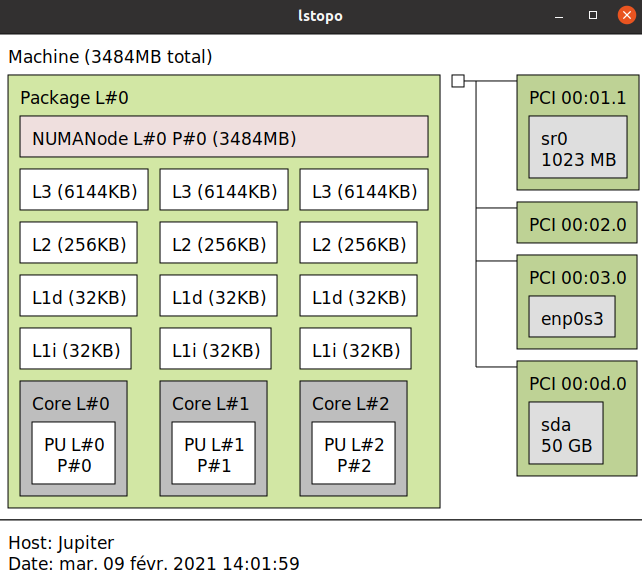

# MN_TP2
### FODOR Gergely, PELISSE VERDOUX Cyprien , VIALLET Camille

## Calcul sur des nombres complexes

Nous avons au sein de notre équipe un CPU de qualité inférieure. Voici, ci-dessous, leurs architectures.




Le CPU1 est un Intel Core i5-7200U, le CPU2 est un AMD A6-9225 RADEON R4 et le CPU3 est un Intel i5-7300HQ. On s'attend à avoir de meilleurs performances sur le CPU1 au cours des tests du TP car le CPU2 et CPU3 font fonctionner une machine virtuel

Après avoir codé les fonctions dans ```complexe.c```, nous avons effectuer le test sur les deux CPU. Nos résultats sont les suivants :
- CPU1 : 0.623 GFLOP/s en addition et 1.367 GFLOP/s pour la multiplication.
- CPU2 : 0.199 GFLOP/s en addition et 0.153 GFLOP/s pour la multiplication.
- CPU3 : 0.732 GFLOP/s en addition et 0.646 GFLOP/s pour la multiplication.


On observe que les performances du CPU2 sont en effet inférieur.

## BLAS1

#### swap
La fonction swap s'occupe d'échanger la valeur de deux vecteurs. Pour cela, l'appel à une variable tierce est nécéssaire pour chacune des fonctions. Le type de cette variable change en fonction de la méthode dans lequel elle est appelé. Au total, pour gerer tous les cas de variable, c'est 4 fonctions qui sont nécéssaires. Pour les floats et les doubles et chacun peut-etre complexe ou non. Pour les complexes, l'utilisation de la variable tierce requiert les types de variables **complexe_float_t** et **complexe_double_t**. Le schéma principale d'échange entre A et B avec comme variable tierce C est:
```C
C = A
A = B
B = C
```
Dans le cas des complexes, il faut également gérer les différentes parties de la structures c'est à dire la partie réel et la partie imaginaire.

#### Fonction de dot
La fonction dot calcule le produit scalaire de deux vecteurs. Pour cela elle multiplie terme à terme les éléments dans le vecteur. Nous avons implémenté différentes fonctions permettant d'avoir des vecteurs de float, de double, de complexe float et de complexes doubles. Deux fonctions permettent également de faire la produit scalaire avec un des vecteur pris comme un complexe conjugé (float ou double).
Pour la fonction ```mncblas_cdotc_sub``` , fonction utilisant des complexes float et effectuant le produit scalaire avec un dex complexe conjugé , nous avons réutilisé les fonctions déjà implementées dans la partie dédié aux nombre complexes.
Ainsi cette ligne de code ( provenant de la fonction ```mncblas_sdot``` ) :
```C
 dot += X[i] * Y[j];
```
devient alors avec des nombres complexes (dont un conjugé):
```C
conjuge_X.real = ((complexe_float_t *)X)[i].real;
conjuge_X.imaginary = -((complexe_float_t *)X)[i].imaginary;
mult = mult_complexe_float(conjuge_X, ((complexe_float_t *)Y)[j]);
dot = add_complexe_float(dot, mult);
```
Les paramétres X et Y sont ici des paramétres de type ```void*``` il est donc necessaire d'effectuer un cast pour pouvoir les utiiser en tant que complexe.
En terme de performance, pour les flotants à precision simple, nous sommes à 0.3 GFLOP/s et pour les complexes à précision simple, nous sommes à 0.7 GFLOP/s

#### nrm2
La fonction nrm2 calcule la norme d'un vecteur. Ainsi, nous avons une boucle calculant la somme des membres au carrés suivi d'une racine carré.
```C
for (; i< N; i += incX) {
  somme += X[i] * X[i];
}
return (float) sqrt(somme);
```
Afin de maximiser les performances, `i` est déclarer plutôt tel que :
```C
register unsigned int i = 0 ;
```
En terme de performance, pour les flotants à precision double, nous sommes à 1.3 GFLOP/s et pour les complexes à précision double, nous sommes à 3.2 GFLOP/s

## BLAS2
On peut voir ci dessous l'odre dans lequel sont rangés les éléments de la matrice dans un tableau à une dimension :


Cas d'une matrice rangée en RowMajor :
 1 2 3
 4 5 6
 7 8 9
 Stockée ainsi dans la variable A : [1,2,3,4,5,6,7,8,9]


Lors de la multiplication de la matrice avec le vecteur , le resultat final sera un vecteur de la taille du nombre de ligne de la matrice.
On crée pour cela un tableau temporaire float ```float y_temp[M]``` qui contiendra cette partie du calcul : ```alpha*A*x```
```C
y_temp[ligne] = y_temp[ligne] + A[indice_matrice] * alpha * X[colonne];
```
```C
        for (int ligne = 0; ligne < M; ligne += incY)
        {
            for (int colonne = 0; colonne < N; colonne += incX)
            {
                y_temp[ligne] = y_temp[ligne] + A[indice_matrice] * alpha * X[colonne];
                indice_matrice++;
            }
            Y[ligne] = y_temp[ligne] + beta * Y[ligne];  
        }
```

Il est utile de noter que pour un tableau rangé en ColMajor, lire les indices de 0 à N revient à lire sa transposée.

Pour lire un tableau en ColMajor ( ou la transposée d'un tableau en RowMajor) on procéde alors ainsi :
On lit les éléments de M en M puis on réinialise l'indice du tableau de la matrice au nouveau numéro de ligne à chaque fois que l'on change de ligne.

Pour les fonctions utilisant des nombres complexes, le principe est exactement le même. Toutefois il faut prendre garde à ce que les valeurs passées en paramétre ( excepté le vecteur Y) ne soient pas modifié dans cette fonction. C'est pour cette raison que l'on crée une variable locale  ```complexe_float_t *A_complexe = malloc(sizeof(complexe_float_t) * lda); ```. Cela nous permet de stocker la valeur du conjugé de la matrice sans toutefois modifier celle-ci.

Pour ce qui est des performances, nous avons calculé pour des données en *flotant précision simple* et *complexe précision simple*. Les résultats sont les suivants :
* 1.3 GFLOP/s pour les `float`.
* 4.5 GFLOP/s pour les `complexe_float`.

## BLAS3

Comme pour BLAS2, l'ordre des éléments qui seront lu dans les matrices est déterminé par *RowMajor* ou *ColMajor*. Dans ces fonctions, 3 matrices sont utilisées, nous les appellerons A, B et C pour la suite. Le résultat que nous devons obtenir après l'utilisation de la fonction est du type: ```C := alpha*op(A)*op(B) + beta*C```
op(A) et op(B) représente un certain défi car il faut être capable en fonction des valeurs passées en paramètre de donner sois la matrice, sois sa transposée, sois sa matrice adjointe. Il est à noté que la matrice adjointe d'une matrice de réels, dans notre cas de type *float* ou *double* correspond seulement à la matrice transposé. Il faut donc diverses fonctions qui servent seulement à obtenir en fonction des paramètres les bonnes matrices. Ensuite en ce qui concerne les tailles des matrices, nous partons du principe que la multiplication est possible, c'est-à-dire que les valeurs passés en paramètre permettent l'utilisation de l'algorithme. La phase de vérification des valeurs doit donc dans notre cas être implementé lors de l'utilisation de la bibliothèque. Dans notre implémentation, nous avons fait le choix de supporter les calculs sur des matrices carrés et non carrés. Cela nous a mener à un algorithme lourd mais plus polyvalent. Il est, en effet, capable de réaliser les opérations de transposition, d'adjointement sur les matrices.

Parlons maintenant de l'algorithme:
Pour multiplier deux matrices, il nous faut, dans notre cas, 3 boucles for imbriquées permettant d'additioner tous les termes correctements. Il est à noté que la partie réalisant éventuellement la transposition ou l'adjointement est quelque peu séparé du reste, ainsi, l'algorithme se charge seulement de la mutliplication des matrices, voyons maintenant le pseudo-code:
```
Entrée: Matrice A de dimension M * K (ligne * colonnes)
        Matrice B de dimension K * N (ligne * colonnes)
        Matrice C de dimension M * N (ligne * colonnes)
        Alpha un scalaire
        Beta un scalaire
        lda, ldb: int permettant de savoir à quel indice du tableau travailler

Sortie: Le résultat de alpha*op(A)*op(B) + beta*C contenu dans C

Variables: Somme: variable contenant la somme des multiplications de terme pour une valeur de la matrice d'arrivé
           table_tmp: variable contenant une matrice de A * B

Algorithme:

Pour i de 0 à M par pas de 1:
  Pour j de 0 à N par pas de 1:
     somme = 0
     Pour k de 0 à K par pas de 1:
         somme = somme + A[i*lda+k] * B[k*ldb+j]
     table_tmp[i*ldc+j = somme * alpha
Pour f de 0 à M*N par pas de 1:
  C[f] = C[f] * beta
  C[f] = C[f] + table_tmp[f]

```

Au final, le résultat est stocké dans la matrice C.

Un problème auquel nous avons du faire face, est l'utilisation du mot clé *const* qui nous empêche de modifier les valeurs des matrices A et B lors de la transposition ou de l'adjointement. Pour parer à cela, nous avons utilisé de nouvelles valeurs qui elles n'étaient pas déclarées *const*.
Un point sur lequel nous pourrions retravailler est la réécriture des fonctions *mult_complexe_float* et *mult_complexe_double* utilisé lors de la multiplication de deux matrices complexes. L'appel de ces fonctions ralentit notre programme et le code contenu n'est pas très difficile à refaire pour améliorer la rapidité.

En ce qui concerne les résultats obtenus, ils n'ont été calculés que pour une matrice de *double* et de *complexe_double*, ceci afin de montrer la différence entre les deux types.
* Pour le type *double* nous obtenons 1.074 Gflop/s
* Pour le type *complexe_double* nous obtenons 2.971 Gflop/s


## Conclusion sur les performances.


Comme nous pouvons l'apercevoir dans ce tableau, il y a de meilleurs performances lors de l'utilisation des complexes, le gain est pour nos fonctions ici representées d'au moins 1.7. Pour le cas de BLAS3, le coeficient de Gflop entre l'utilisation ou non de complexes monte jusqu'a 2.74. Il est à noter que pour le cas de la fonction SWAP, aucun calcul flotant n'est fait donc ce sont ici des GBytes/s qui sont representés et non des GFlops/s. 
